# HeartMuLa Studio

HeartMuLa Studio is a standalone Windows desktop app for local HeartMuLa song
creation, lyric timing, cover art, stem extraction, multitrack editing, sound
effects, and lyric-video rendering.

## Download

Run [HeartMuLa Studio.exe](HeartMuLa%20Studio.exe). Model checkpoints are not
included; place the required HeartMuLa files in `ckpt\` as described in
[`studio/README.md`](studio/README.md).

## Resulting song

Listen to the resulting song on [YouTube](https://youtu.be/NQxVi77k3Hs).

## App screenshots

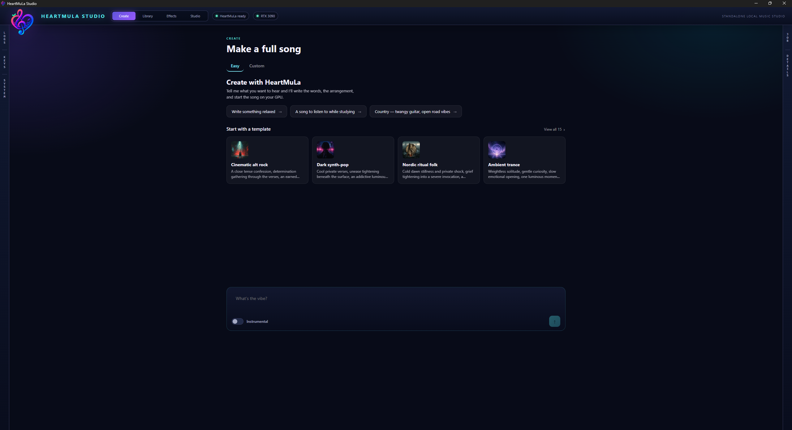
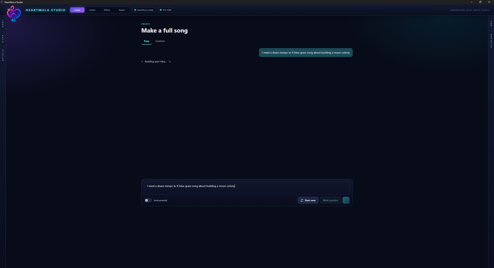
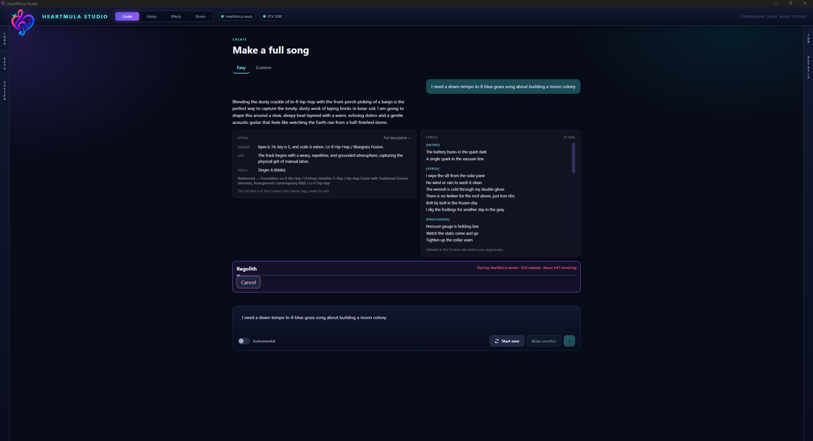
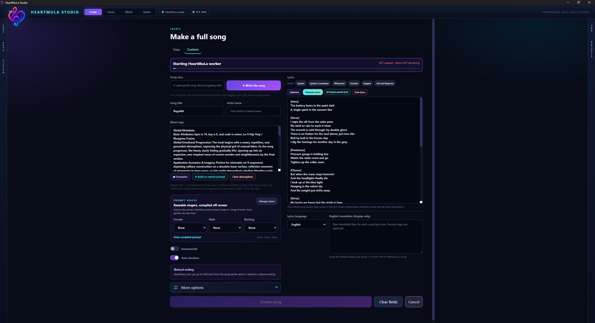
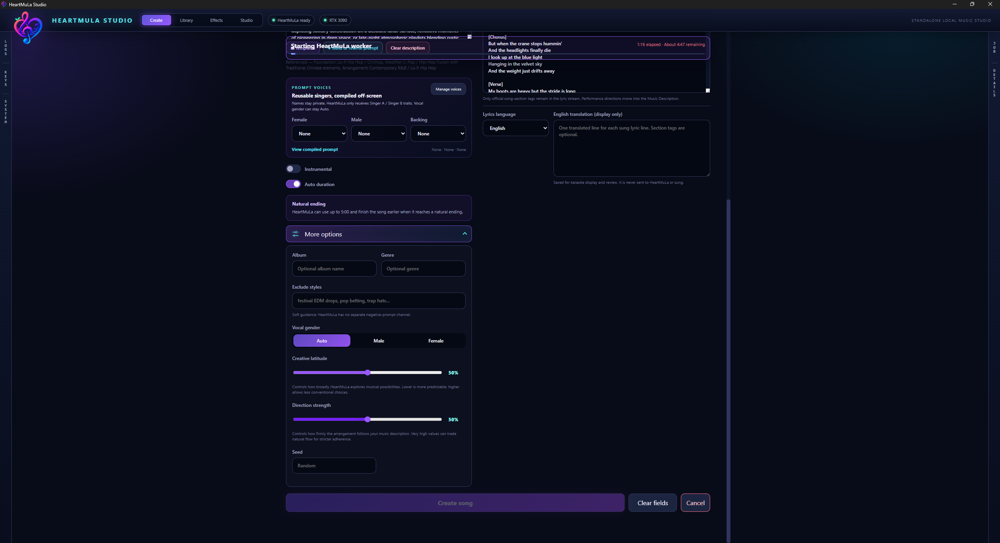
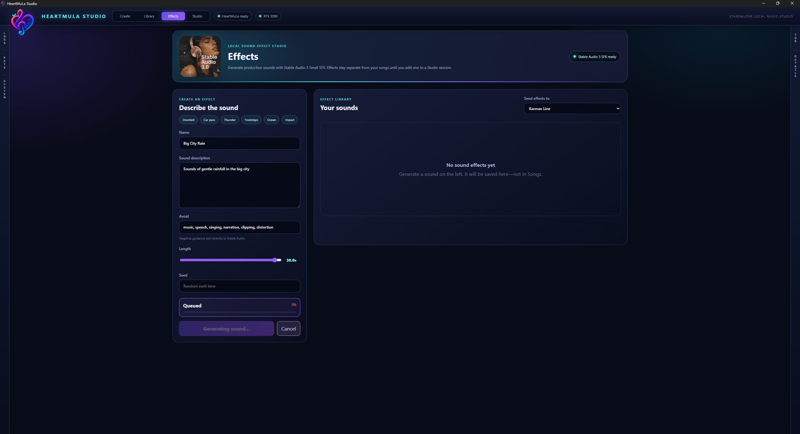
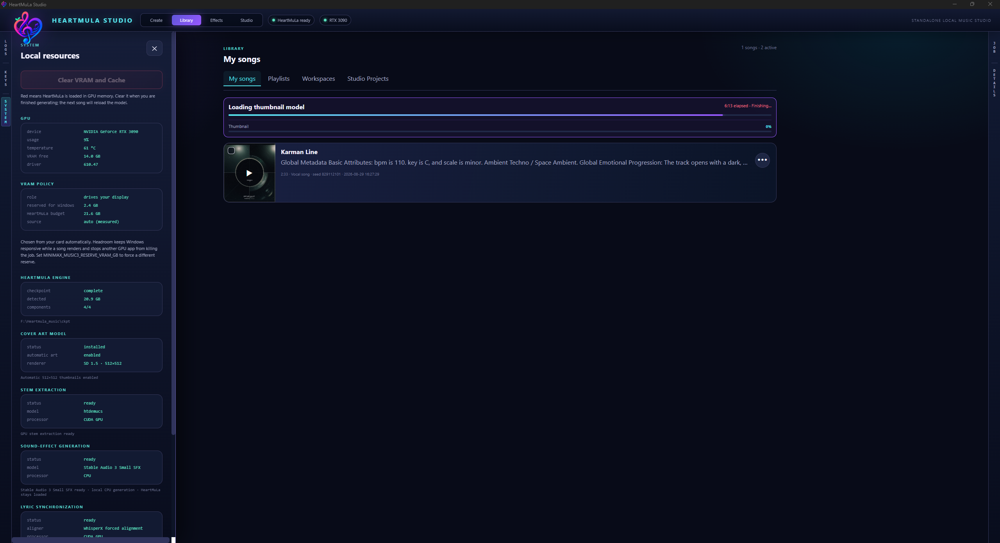
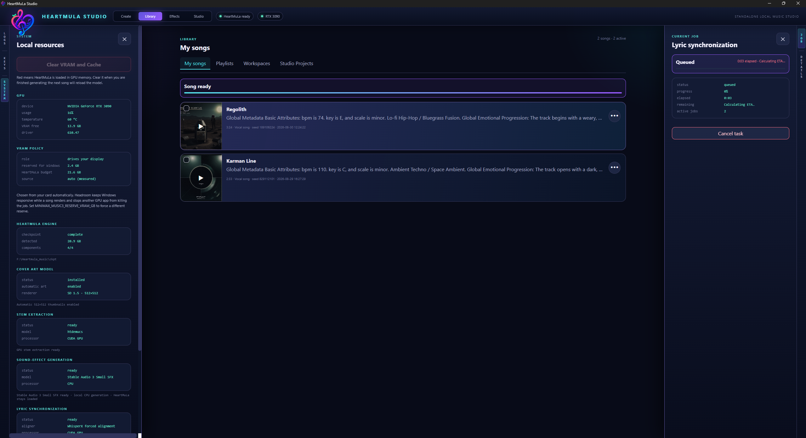
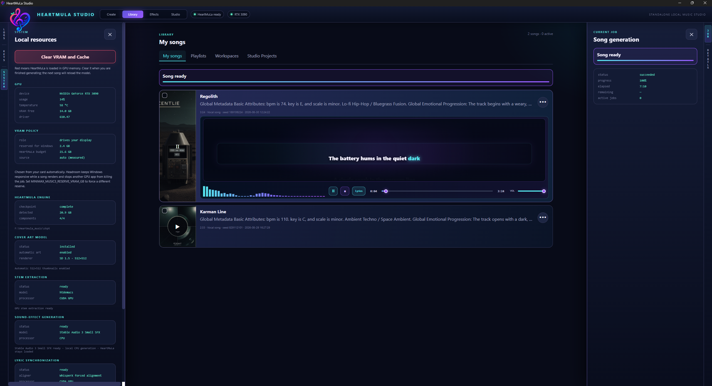
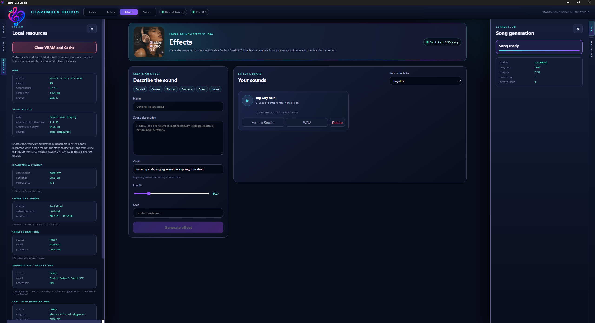
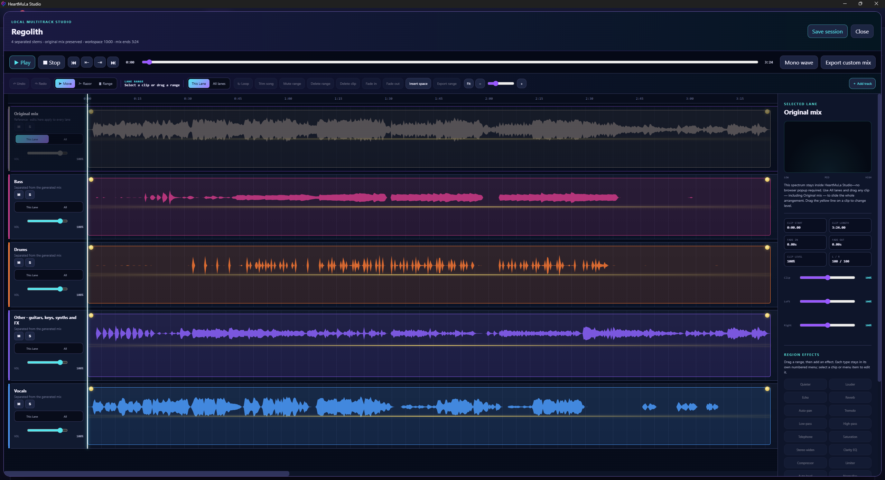
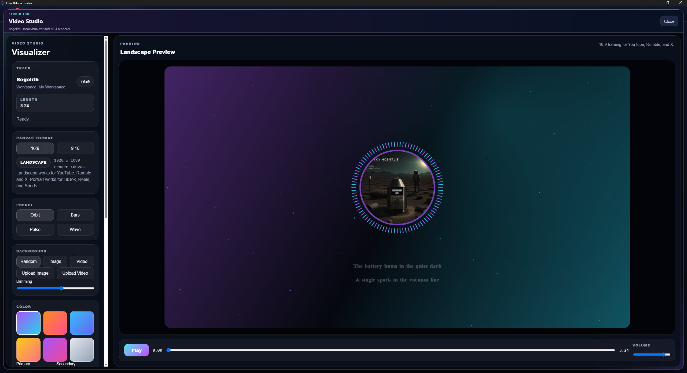
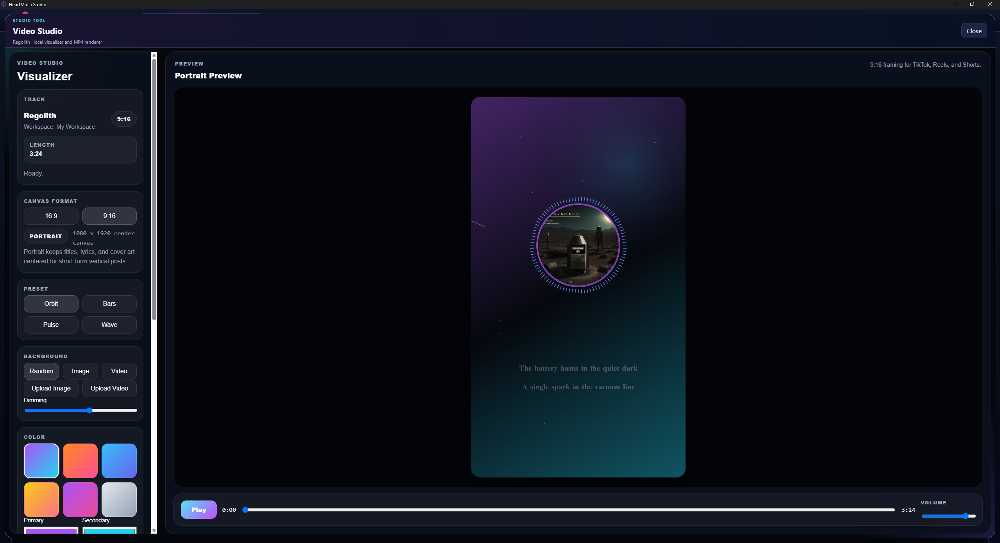
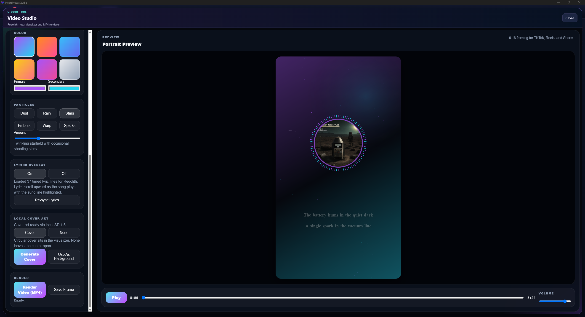
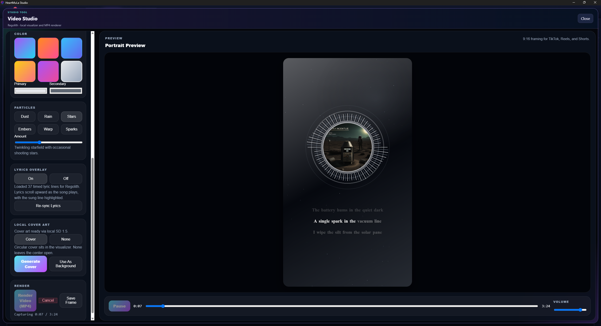

## Privacy

No personal API keys are included. Optional writing-provider keys are stored in
the local, ignored Studio vault and must never be committed.

## Source

The complete application source is in [`studio/`](studio/README.md), including
the desktop UI, sidecar services, multitrack editor, video studio, screenshots,
and build documentation.
